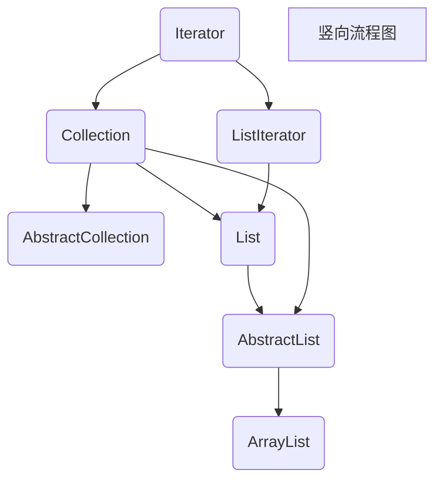
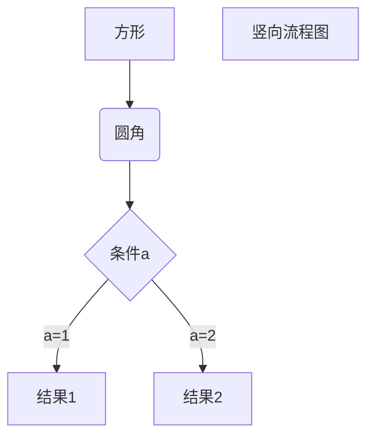

### Learn & Android & ArrayList

容器

### 继承关系

```mermaid
graph TD
A(Iterator) --> B(Collection)
A(Iterator) --> C(ListIterator)
B --> G(AbstractCollection)
B --> D(List)
C --> D(List)
D --> E(AbstractList)
E --> F(ArrayList)
B --> E
H[竖向流程图]
```

```mermaid
graph TD
A[方形] --> B(圆角)
    B --> C{条件a}
    C --> |a=1| D[结果1]
    C --> |a=2| E[结果2]
    F[竖向流程图]
```

### [HOME](https://daixuenan.github.io/)